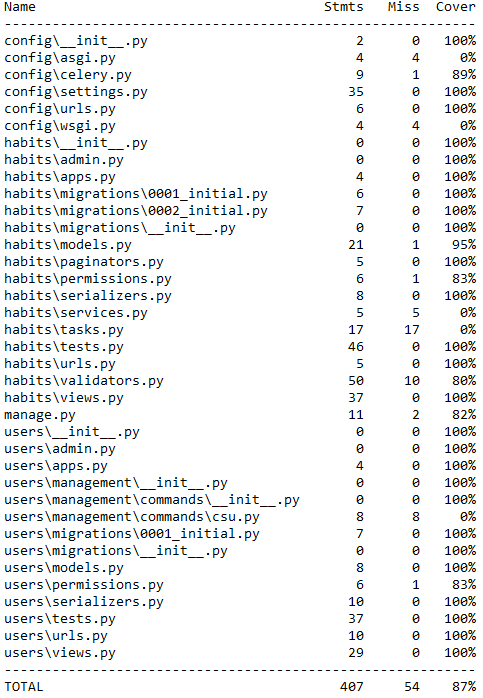

# :iphone: Трекер полезных привычек

## Описание

В 2018 году Джеймс Клир написал книгу «Атомные привычки», которая посвящена приобретению новых полезных привычек и искоренению старых плохих привычек. Проект представляет собой API приложение для поддержки выполнения пользователем задуманных привычек, а также вознаграждение за их выполнение.

## О проекте

*Бэкенд-часть SPA веб-приложения.*

- В проекте представлены приложения *users*, *habits*.
- Реализованы модели (User, Habit).
- Для реализации CRUD используются Viewsets и Generic-классы.
- Для работы контроллеров описаны сериализаторы.
- В проекте используется JWT-авторизация, каждый эндпоинт закрыт авторизацией.
- Реализованы права доступа для объектов:
  - каждый пользователь имеет доступ только к своим привычкам по механизму CRUD;
  - пользователь может видеть список публичных привычек без возможности их как-то редактировать или удалять.
- Настроена валидация для сохранения привычки:
  - исключён одновременный выбор связанной привычки и указания вознаграждения;
  - время выполнения не больше 120 секунд;
  - в связанные привычки могут попадать только привычки с признаком приятной привычки;
  - у приятной привычки не может быть вознаграждения или связанной привычки;
  - нельзя выполнять привычку реже, чем 1 раз в 7 дней;
- Реализована пагинация для вывода привычек.
- Написаны тесты для проверки всех имеющихся эндпоинтов в проекте.
- Подключён и настроен вывод документации для проекта. Для работы с документацией проекта использовалась библиотека drf-yasg.
- Настроена интеграцию с Телеграмом.
- Реализована периодическая задача *send_reminder* в Celery с использованием celery-beat для напоминания о том, в какое время какие привычки необходимо выполнять.
- Настроен CORS.

## Установка и запуск

### Склонируйте репозиторий:

```bash
git clone https://github.com/CHAPAPOPA/habit.git
```

### Перейдите в папку с проектом

```bash
cd habit
```

### Установите зависимости:

Сначала активируем poetry
```bash
poetry shell
```

Затем установим все зависимости из pyproject.toml
```bash
poetry install
```

Для определения необходимых переменных окружения воспользуйтесь шаблоном
```bash
.env.sample
```

Сделайте миграции
```bash
python manage.py makemigrations
python manage.py migrate
```

### Запуск приложения
Для того чтобы запустить проект, выполните команду
   ```sh
   python3 manage.py runserver
   ```
Работу каждого эндпоинта необходимо проверять с помощью Postman.

### Запуск задач в Celery
В проекте реализованы отложенные и периодические задачи.
Для запуска **периодической задачи**, выполните команды
```sh
   celery -A config  worker --loglevel=info
   ```
и
```sh
    celery -A config beat -l INFO -S django
   ```

---

Этот README файл предоставляет основную информацию о проекте, его установке и использовании.

## Тестирование

